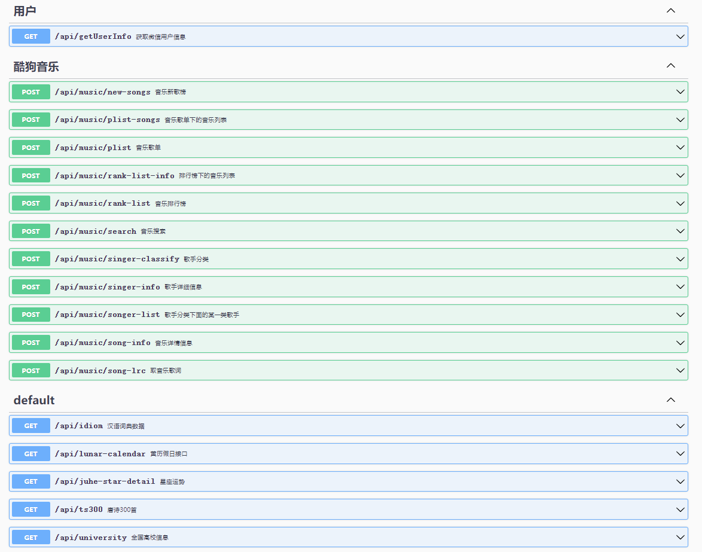
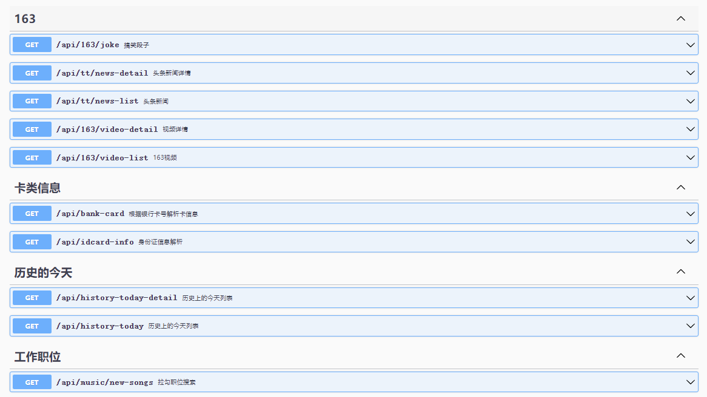

## Express
>项目基于`express`+`sequelize`+`mysql`+`express-validator`
> 基于node+express爬虫 API接口项目,包括全国高校信息、成语诗歌、星座运势、历史的今天、音乐数据接口、图片壁纸、搞笑视频、热点新闻资讯 详情接口数据

- [x] express
- [x] sequelize
- [x] mysql
- [x] `express-validator`参数表单校验
- [x] 使用`cheerio`解析爬虫页面
- [x] 集成`ejs`模板
- [x] 集成`swaggerUI`接口文档
- [x] `nodemon`项目开发动态热更新
- [x] `dotenv`管理配置系统参数
- [x] 包含接口sign请求验证
- [x] `log4js` 错误日志收集

### 环境要求
>需要安装`node`环境,`mysql`数据库

### 部署运行
```shell
$ git clone https://github.com/ecitlm/Node-SpliderApi.git
$ npm install
#  start project dev
$ npm run dev
# starting prd
$ npm run prd
#localhost:3001

```
### 服务器部署

> 在服务器中使用 `pm2` 对 `node` 服务进行进程守护

```shell
#启动进程/应用
pm2 start npm --watch --name tools -- run prd
pm2 restart tools
pm2 stop tools
pm2 delete tools
```
### 数据库
>`mysql`中包含、唐诗300、成语、历史的今天、星座运势(聚合平台数据-需要申请自己的APPCODE)、用户表等数据
> 项目目录`bak-file`文件夹可查看

### 接口文档
>启动项目之后`http://localhost:3001/api-docs/` 可查看接口文档页面




### 错误码说明

| 状态码  | 含义                               | 备注 |
|------| ---------------------------------- | ---- |
| 200  | 响应正常                           |      |
| 1001 | 参数无效、如一个不存在的id         |      |
| 1002 | 参数为空、验证不通过、参数类型错误 |      |
| 1003 | 请求签名异常、非法 |
| 404  |请求不存在 |
| 405  | 请求方式错误|
| 9999 | 第三方接口请求异常|
| 500  |系统异常|
